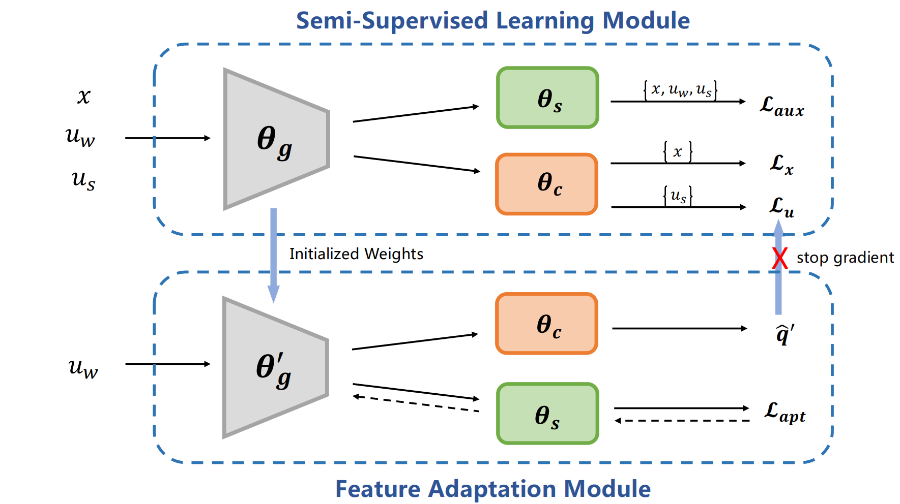

# Generalized Semi-Supervised Learning via Self-Supervised Feature Adaptation (SSFA)
This is an implementation of [Generalized Semi-Supervised Learning via Self-Supervised Feature Adaptation](https://arxiv.org/abs/2405.20596) in the Annual Conference on Neural Information Processing Systems (NeurIPS 2023).


**Generalized Semi-Supervised Learning via Self-Supervised Feature Adaptation**

Jiachen Liang, Ruibing Hou, Hong Chang, Bingpeng Ma, Shiguang Shan, Xilin Chen

<p align="center">
  
</p>  

Abstract: *Traditional semi-supervised learning (SSL) assumes that the feature distributions of labeled and unlabeled data are consistent which rarely holds in realistic scenarios. In this paper, we propose a novel SSL setting, where unlabeled samples are drawn from a mixed distribution that deviates from the feature distribution of labeled samples. Under this setting, previous SSL methods tend to predict wrong pseudo-labels with the model fitted on labeled data, resulting in noise accumulation. To tackle this issue, we propose Self-Supervised Feature Adaptation (SSFA), a generic framework for improving SSL performance when labeled and unlabeled data come from different distributions. SSFA decouples the prediction of pseudo-labels from the current model to improve the quality of pseudo-labels. Particularly, SSFA incorporates a self-supervised task into the SSL framework and uses it to adapt the feature extractor of the model to the unlabeled data. In this way, the extracted features better fit the distribution of unlabeled data, thereby generating high-quality pseudo-labels. Extensive experiments show that our proposed SSFA is applicable to various pseudo-label-based SSL learners and significantly improves performance in labeled, unlabeled, and even unseen distributions.*


## Usage


### Dataset
Download dataset and put it into './data'

[CIFAR-100-C](https://zenodo.org/record/3555552#.YFxpQmQzb0o): corrupted cifar100 testset

CIFAR-100-C-train: generate corrupted cifar100 trainset by:
```
cd data
python CIFAR-100-C-train/make_cifar_c.py
```

The file structure looks like
```
data/
|–– CIFAR-100-C/
|–– CIFAR-100-C-train/
```
### Train

#### CIFAR-100 (corruption types: mix10, corruption level: 5, corruption ratio: 1.0)
Train the model by 400 labeled data of CIFAR-100 dataset with FixMatch:
```
CUDA_VISIBLE_DEVICES=1 python ./train.py --dataset cifar100 --num-labeled 400 --arch wideresnet --batch-size 64 --lr 0.03 --wdecay 0.001 --expand-labels --seed 5 --total-steps 102400 --out results/cifar100@400/fixmatch --corruption mix10 --corruption_level 5 --ratio 1.0 --mu 2
```

Train the model by 400 labeled data of CIFAR-100 dataset with FixMatch-SSFA:
```
CUDA_VISIBLE_DEVICES=1 python ./train.py --dataset cifar100 --num-labeled 400 --arch wideresnet --batch-size 64 --lr 0.03 --wdecay 0.001 --expand-labels --seed 5 --total-steps 102400 --out results/cifar100@400/ssfa_layer3 --corruption mix10 --corruption_level 5 --ratio 1.0 --ssl rotation --update --shared layer2 --mu 2
```

